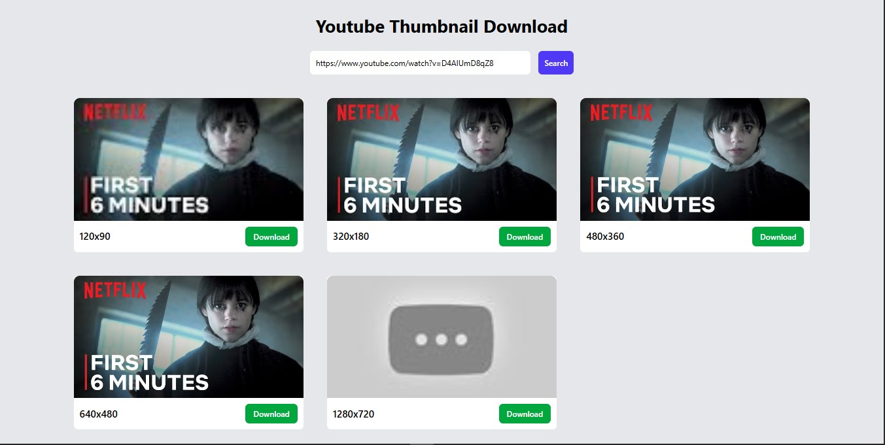

# 🎬 YouTube Thumbnail Downloader  

A simple React app to fetch and download **high-quality YouTube thumbnails** in multiple resolutions. Built with **React.js, Tailwind CSS, and React Toastify**.  

---

## 🚀 Features  
- 🔗 Enter any valid YouTube video URL.  
- 🖼️ Fetch thumbnails in multiple sizes:  
  - 120x90 (default)  
  - 320x180 (medium)  
  - 480x360 (high)  
  - 640x480 (standard)  
  - 1280x720 (max resolution)  
- ⬇️ Download thumbnail images directly.  
- ⚡ Instant results, no API key required.  
- 🎉 Toast notifications for invalid URLs.  

## 📷 Preview

## 🛠️ Tech Stack  
- **React.js**  
- **Tailwind CSS**  
- **Animate.css**  
- **get-youtube-id** (extracts YouTube video ID)  
- **React Toastify** (notifications)  

---

## 📂 Project Structure  
